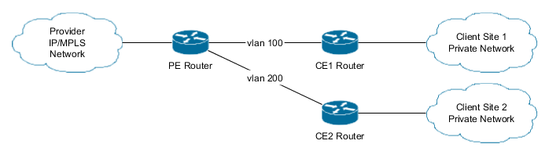
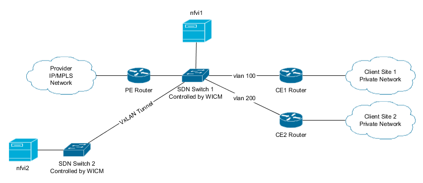
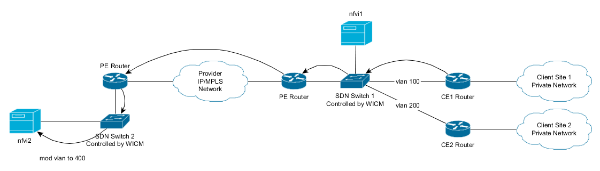
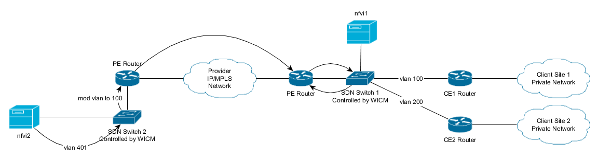
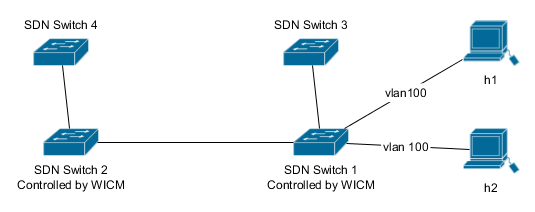

<!---
    Copyright 2014-2016 PTIN

    Licensed under the Apache License, Version 2.0 (the "License");
    you may not use this file except in compliance with the License.
    You may obtain a copy of the License at

    http://www.apache.org/licenses/LICENSE-2.0

    Unless required by applicable law or agreed to in writing, software
    distributed under the License is distributed on an "AS IS" BASIS,
    WITHOUT WARRANTIES OR CONDITIONS OF ANY KIND, either express or implied.
    See the License for the specific language governing permissions and
    limitations under the License.

-->
# WICM
###WAN Infrastructure and Connectivity Manager

WICM is an implementation of the ETSI MANO defined WIM (WAN Infrastructure Manager) for the T-Nova project. 

WIM is described [ETSI ETSI GS NFV-MAN 001 V1.1.1](http://www.etsi.org/deliver/etsi_gs/NFV-MAN/001_099/001/01.01.01_60/gs_nfv-man001v010101p.pdf) as:

>Interface with the underlying Network Controllers to request virtual connectivity services. In such a case, the VIMs/WIMs interface with the Network Controllers over the Nf-Vi reference point. There could be multiple Network Controllers under a VIM (for example, if different virtual network partitioning techniques are used within the domain); in this case, the VIM is responsible to request virtual networks from each underlying Network Controller and setup the interworking function between them. This acknowledges the fact that there might be existing Network Controllers in the NFVI already deployed and in use for connectivity prior to the instantiation of the VIM/NFVO. 

>Establish the connectivity services directly by configuring the forwarding tables of the underlying Network Functions, hence becoming the Network Controller part of the VIM (although it is not explicitly shown in the figure). In such a case, the VIM directly controls some elements, for example, a software switch (a.k.a. vSwitch). This could also be the case if there are Network Functions that do not fall within the Administrative Domain of a Network Controller. 

## WICM in T-Nova

WICM in T-Nova works as an enabler for allowing the clients to acquire/use
virtual network functions as a service. It is responsible for redirecting traffic from a client into a or several
NFVI-PoP(s), by means of SDN switches. The switches are connected using VxLAN
tunnels when direct cable connections are unavailable.

Consider the base scenery for IP/MPLS VPN:

PE stands for Provider Edge and CE for Client Edge. Client Site 1 has vlan 100 for its attachment circuit to the PE router, while Client Site 2 has vlan 200.

Client 1 would like to use some network virtual functions provided by it's
network provider, available at the NFVI-PoPs: nfvi1 and nfvi2. nfvi1 is close to
client 1 while nvfi2 if farther away. Which one to use is negotiated by the
client and the provider, even both can be used. In this example only nfvi2 will
be used for simplicity sake.

To redirect the traffic from client 1 to the NFVI-PoP we will use a SDN
switch:

Now the orchestrator may request WICM to redirect traffic from client 1 into the
nfvi-pops, WICM is also in charge to configure the SDN switches to send
processed packets to their original destination.

This request is done in a two-step process:

1. Orchestrator requests WICM to reserve vlans for each of the NFVI-PoP(just for
   nfvi2 in this case) that are going to be used for the client.
   
2. WICM answers with 2 vlans per nfvi pop requested. These vlans are now reserved for that client.

3. Orchestrator instantiates the respective services in the correct vlans in
   order to receive the redirected traffic. And then, once the VNFs are ready
   requests WICM to start redirecting traffic.

4. Traffic redirection is enable!

####For example if WICM reserved vlans 400 and 401 at nfvi2 the traffic would flow like this:

##### From the Client site to the pop:

##### From the pop back to sw 1 to be sent to its original destination:

Redirection ends at sw 1 and from there on the processed packets will go on
normally. Redirection on the other direction (internet to the  client site) is
similar.

The whole process is transparent to both the PE and CE routers involved, with
them only seeing vlan 100. Ensuring compatibility with legacy networks with
minimum cost.

SDN switch 2 modifies the vlans assuring that packets coming from the client site enter the pop with vlan 400
and packets coming from the 'internet' enter the pop with vlan 401. 
This allow
the pop to know the traffic direction (as both directions are redirected) to to
act properly. The switch also the vlan back to 100, so the

Finally, packet leave the pop with the other vlan that they
entered in order to allow the SDN to tell the traffic direction and do the
proper forwarding.

One nfvi-pop can be shared by several clients, just as long as vlans are
available.

## Components

#### OpenDaylight

WICM uses OpenDaylight plus the VTN (Virtual Tenant Network) plugin to control
the SDN switches and handle the low level redirection details.

#### MariaDB/mySQL

WICM uses MariaDB or mySQL for persistence.

## Deployment

WICM is presented as a self-contained docker-compose file incorporating WICM,
OpenDaylight and MariaDB. To run do on the WICM folder:

<pre>
docker-compose build
docker-compose up -d
</pre>

Then you will need to initiate the database:
<pre>
curl -X DELETE  WICM_IP:12891/reset_db
</pre>

In a production deployment this option should be disabled.

WICM will be available on port 12891.

#### Running just WICM

To do so use the wicm.dockerfile found in the WICM directory. Make sure to
update the configuration file (wicm.ini).

## Demo

To test WICM you can use the Vagrantfile(demo/Vagrantfile) provided. It will create a virtual
machine containing WICM and a simple test network:

Switches 3 and 4 simulate the NFVI-PoPs, are pre-programmed and not controlled by the WICM. Hosts h1 and h2 
simulate the CE and PE, respectively. 

To start the demo, on the demo directory do:

<pre>
vagrant up
</pre>

Once the machine is up it can be accessed:

<pre>
vagrant ssh 
</pre>
Enter the mininet and try:

<pre>
sudo screen -rx
h1 ping h2
</pre>

<pre>
mininet> h1 ping h2
PING 10.0.0.2 (10.0.0.2) 56(84) bytes of data.
From 10.0.0.1 icmp_seq=1 Destination Host Unreachable
From 10.0.0.1 icmp_seq=2 Destination Host Unreachable
From 10.0.0.1 icmp_seq=3 Destination Host Unreachable
</pre>

The ping fails because the NAP(Network Access Point) is not yet registered, to register it issue the 
following command on the virtual machine:

<pre>
curl -X POST localhost:12891/nap \
    -H "Content-type: application/json"  \
    -d'{"nap":{"mkt_id":"c1_nap1","client_mkt_id":"c1","switch":"openflow:1","ce_port":1,"pe_port":2,"ce_transport":{"type":"vlan","vlan_id":100},"pe_transport":{"type":"vlan","vlan_id":100}}}'
</pre>

The payload in a read friendly format:
<pre>
{
    "nap":{
        "mkt_id":"c1_nap1",
        "client_mkt_id":"c1",
        "switch":"openflow:1",
        "ce_port":1,
        "pe_port":2,
        "ce_transport":{
            "type":"vlan",
            "vlan_id":100
        },
        "pe_transport":{
            "type":"vlan",
            "vlan_id":100
        }
    }
}
</pre>

Meaning that client c1 has a NAP identified by c1_nap1 on SDN switch openflow:1.
In the switch's port 1 with vlan 100 is connected the CE and on port 2 is
connected the PE also with vlan 300. Only vlans are supported at the moment. The
ids fields are assign/used by orchestrator (TeNOR).

This allows WICM to configure the SDN switch to allow the client site to access
the internet and later this will be the point where the redirection to the
NFVI-PoP(s) will occur.

Now the ping will work.

<pre>
mininet> h1 ping h2 
PING 10.0.0.2 (10.0.0.2) 56(84) bytes of data.
64 bytes from 10.0.0.2: icmp_seq=1 ttl=64 time=1.95 ms
64 bytes from 10.0.0.2: icmp_seq=2 ttl=64 time=0.183 ms
64 bytes from 10.0.0.2: icmp_seq=3 ttl=64 time=0.261 ms
</pre>

Now that the basic connectivity is up, redirection is the next step. First we
register the NFVI-PoPs, in this case switches s3 and s4 that will circulate the packets in the assigned vlans:

<pre>
curl -X POST localhost:12891/nfvi \
    -H "Content-type: application/json"  \
    -d '{"nfvi":{"mkt_id":"nfvi1","switch":"openflow:1","ce_port":3,"pe_port":3}}'

curl -X POST localhost:12891/nfvi \
    -H "Content-type: application/json"  \
    -d '{"nfvi":{"mkt_id":"nfvi2","switch":"openflow:2","ce_port":1,"pe_port":1}}'
</pre>

The payload in a read friendly format:
<pre>
{
    "nfvi":{
        "mkt_id":"nfvi1",
        "switch":"openflow:1",
        "ce_port":3,
        "pe_port":3
    }
}
</pre>

Meaning that NFVI-PoP nfvi1 is available in SDN switch openflow:1, in port 3 for
both CE and PE links. The NFVI-PoP has no client associated because it belongs
to the service provider and may hold VNFs for several clients. Payload for the
second request is similar.

We are now ready to start redirecting from NAP c1_nap1 to the NFVI-PoPs:

The first step of the process:

<pre>
curl -X POST localhost:12891/vnf-connectivity \
    -H "Content-type: application/json" \
    -d'{"service":{"ns_instance_id":"service1","client_mkt_id":"c1","nap_mkt_id":"c1_nap1","nfvi_mkt_id":["nfvi1"]}}'
</pre>

The payload in a read friendly format:

<pre>
{
    "service":{
        "ns_instance_id":"service1",
        "client_mkt_id":"c1",
        "nap_mkt_id":"c1_nap1",
        "nfvi_mkt_id":[
            "nfvi1"
        ]
    }
}
</pre>

Requesting a redirection from c1_nap1 to nfvi1. You may have noticed that the nfvi_mkt_id is an array, that is because multi nfvi pop is supported. 
More on this latter.

Once we make this request to WICM it returns:

<pre>
{
  "allocated": {
    "ns_instance_id": "service1", 
    "path": [
      {
        "ce_transport": {
          "type": "vlan", 
          "vlan_id": 400
        }, 
        "nfvi_id": "nfvi1", 
        "pe_transport": {
          "type": "vlan", 
          "vlan_id": 401
        }
      } 
    ]
  }
}
</pre>

Meaning vlans 400 and 401 are reserved for the request service1, keep in mind
that at this time no redirection is occurring. The vlans are reserved so 
TeNOR may instantiate the VNFs at nfvi1 correctly to receive the traffic on the
assign vlans.

Once the VNFs are ready, TeNOR request WICM to start the traffic redirection.
As mentioned before the nfvi-pops are already configured, so one can immediately:
<pre>
curl -X PUT localhost:12891/vnf-connectivity/service1
</pre>

You can use, on the virtual machine, to confirm that the packets are passing
through nfvi1 while h1 is pinging h2.

<pre>
watch sudo ovs-ofctl -Oopenflow13 dump-flows s3
</pre>

Notice that the n_packets will increase when the redirection is up.

<pre>
Every 2.0s: sudo ovs-ofctl -Oopenflow13 dump-flows s3                                                                                        Thu Sep 22 16:37:52 2016
OFPST_FLOW reply (OF1.3) (xid=0x2):
 cookie=0x0, duration=182430.484s, table=0, n_packets=15, n_bytes=1530, dl_vlan=400 actions=set_field:4497->vlan_vid,IN_PORT
 cookie=0x0, duration=182430.407s, table=0, n_packets=15, n_bytes=1530, dl_vlan=401 actions=set_field:4496->vlan_vid,IN_PORT
 cookie=0x0, duration=182430.177s, table=0, n_packets=0, n_bytes=0, dl_vlan=402 actions=set_field:4499->vlan_vid,IN_PORT
 cookie=0x0, duration=182430.099s, table=0, n_packets=0, n_bytes=0, dl_vlan=403 actions=set_field:4498->vlan_vid,IN_PORT
</pre>

Finally to stop the redirection use:
<pre>
curl -X DELETE localhost:12891/vnf-connectivity/service1
</pre>

### Rest Of the API

Check all NAPs:
<pre>
curl localhost:12891/nap
</pre>

Delete a NAP
<pre>
curl -X DELETE localhost:12891/nap/&lt;NAP_ID&gt;
</pre>

Check all NFVI-PoPs:
<pre>
curl localhost:12891/nfvi
</pre>

Delete a NFVI-PoPs:
<pre>
curl -X DELETE localhost:12891/nfvi/&lt;NFVI_ID&gt;
</pre>

Check all redirections
<pre>
curl localhost:12891/vnf-connectivity
<pre>
